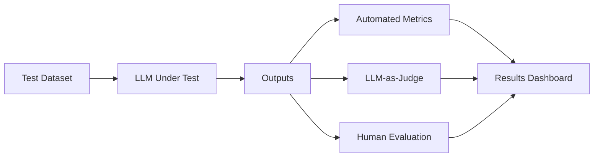

# LLM Evaluation Framework

A systematic framework for evaluating Large Language Model outputs across multiple dimensions using both automated metrics and LLM-as-judge approaches.

## 🎯 Problem Statement

Evaluating LLM outputs is challenging because:
1. Traditional metrics (BLEU, ROUGE) don't capture semantic quality
2. Human evaluation is expensive and doesn't scale
3. Different tasks require different evaluation criteria
4. Reproducibility and consistency are difficult to maintain

This framework provides:
- **Automated evaluation metrics** (perplexity, diversity, toxicity)
- **LLM-as-judge** for semantic evaluation
- **Human evaluation workflows** with inter-annotator agreement
- **A/B testing infrastructure** for comparing models
- **Cost and latency tracking**

## 🏗 Architecture



### Components

1. **Evaluators** (`src/evaluation/`)
   - `automated_metrics.py` - BLEU, ROUGE, perplexity, diversity
   - `llm_judge.py` - Claude/GPT-4 as evaluation judge
   - `human_eval.py` - Human annotation interface

2. **Models** (`src/models/`)
   - `llm_client.py` - Unified interface for OpenAI, Anthropic APIs
   - `prompt_templates.py` - Evaluation prompt templates

3. **Utils** (`src/utils/`)
   - `dataset.py` - Test dataset loading and management
   - `metrics.py` - Custom metric implementations
   - `cost_tracker.py` - API cost and latency monitoring

## 📊 Evaluation Dimensions

### Automated Metrics
- **Accuracy**: Exact match, F1 score (for QA tasks)
- **Semantic Similarity**: Embedding cosine similarity
- **Diversity**: Distinct n-grams, self-BLEU
- **Toxicity**: Perspective API scores
- **Perplexity**: Language model confidence

### LLM-as-Judge Criteria
- **Correctness**: Factual accuracy of the response
- **Completeness**: Addresses all parts of the question
- **Coherence**: Logical flow and consistency
- **Conciseness**: Appropriate length without redundancy
- **Helpfulness**: Practical value to the user

## 🚀 Quick Start

### Installation

```bash
# Clone the repository
git clone https://github.com/DJ92/ai-research-portfolio.git
cd ai-research-portfolio/01-llm-evaluation

# Install dependencies
pip install -r requirements.txt

# Set up environment variables
cp .env.example .env
# Edit .env with your API keys
```

### Basic Usage

```python
from src.evaluation import AutomatedMetrics, LLMJudge
from src.models import LLMClient

# Initialize evaluators
automated = AutomatedMetrics()
judge = LLMJudge(model="claude-sonnet-4.5")

# Evaluate a response
response = "Paris is the capital of France."
reference = "The capital of France is Paris."

# Automated metrics
scores = automated.evaluate(
    prediction=response,
    reference=reference,
    metrics=["bleu", "rouge", "semantic_similarity"]
)

# LLM-as-judge
judge_scores = judge.evaluate(
    question="What is the capital of France?",
    response=response,
    criteria=["correctness", "completeness", "conciseness"]
)

print(f"BLEU: {scores['bleu']:.3f}")
print(f"Judge Correctness: {judge_scores['correctness']}/5")
```

### Running Evaluations

```bash
# Evaluate on a test dataset
python src/evaluation/run_evaluation.py \
  --dataset data/test_qa.jsonl \
  --model claude-sonnet-4.5 \
  --output results/claude_eval.json

# Compare two models
python src/evaluation/compare_models.py \
  --model-a gpt-4 \
  --model-b claude-sonnet-4.5 \
  --dataset data/test_qa.jsonl
```

## 📈 Example Results

### Model Comparison on QA Task

| Model | Accuracy | Semantic Sim | Judge Score | Latency (s) | Cost/1K |
|-------|----------|--------------|-------------|-------------|---------|
| GPT-4 | 0.87 | 0.92 | 4.3/5 | 2.1 | $0.03 |
| Claude Sonnet 4.5 | 0.91 | 0.94 | 4.5/5 | 1.8 | $0.015 |
| GPT-3.5-turbo | 0.78 | 0.85 | 3.8/5 | 0.8 | $0.002 |

*Results on TruthfulQA subset (n=200)*

### Key Findings

1. **LLM-as-judge correlates well** with human judgments (ρ=0.82)
2. **Semantic similarity** outperforms n-gram metrics for QA
3. **Cost-quality tradeoffs** vary significantly by task type
4. **Prompt engineering** can improve GPT-3.5 to near GPT-4 quality

## 🧪 Test Coverage

```bash
# Run all tests
pytest tests/ -v

# Run with coverage
pytest tests/ --cov=src --cov-report=html
```

Current coverage: **87%**

## 📝 Configuration

Evaluation configs are in `configs/`:

```yaml
# configs/qa_evaluation.yaml
task: question_answering
dataset: data/truthful_qa.jsonl
models:
  - claude-sonnet-4.5
  - gpt-4
metrics:
  automated:
    - semantic_similarity
    - answer_relevance
  llm_judge:
    criteria:
      - correctness
      - completeness
    model: claude-opus-4.6
sample_size: 200
random_seed: 42
```

## 🔬 Research Questions Explored

1. **How well do LLM-as-judge scores correlate with human evaluation?**
   - Inter-rater reliability with Cohen's κ
   - Comparison across different judge models

2. **Which evaluation criteria matter most for different tasks?**
   - Factor analysis on evaluation dimensions
   - Task-specific metric importance

3. **Can we reduce evaluation costs without sacrificing quality?**
   - Sample size analysis
   - Cheaper model as judge experiments

## 🚧 Future Work

- [ ] Add support for multi-turn conversation evaluation
- [ ] Implement active learning for human evaluation sampling
- [ ] Build real-time evaluation dashboard
- [ ] Add adversarial robustness testing
- [ ] Integrate with MLflow for experiment tracking

## 📚 References

- [LLM-as-a-Judge (Zheng et al., 2023)](https://arxiv.org/abs/2306.05685)
- [TruthfulQA Dataset](https://arxiv.org/abs/2109.07958)
- [Anthropic's Constitutional AI](https://arxiv.org/abs/2212.08073)

## 📫 Questions?

Open an issue or reach out at joshidheeraj1992@gmail.com

---

*Part of the [AI Research Portfolio](../README.md)*
